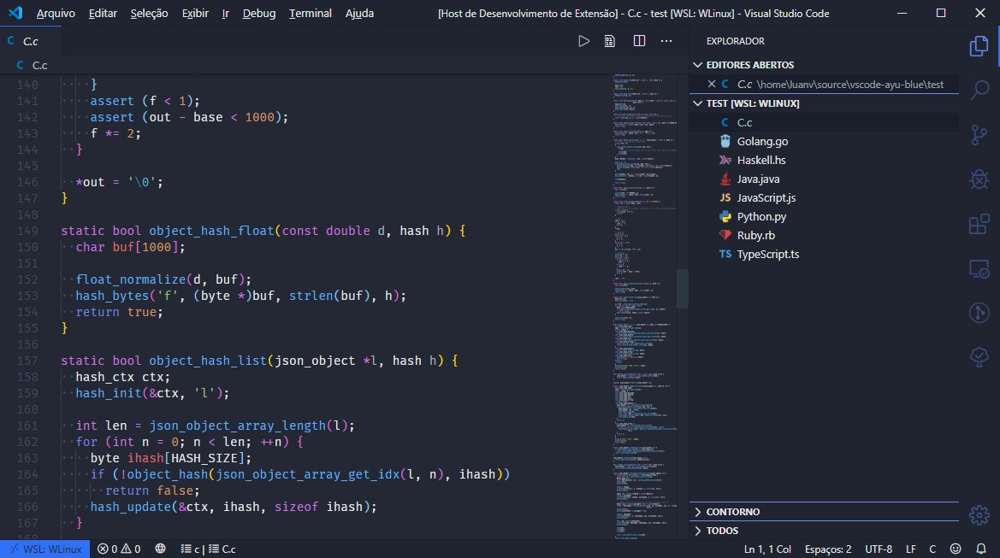

# vscode-night-blue-theme 

this is a vscode color theme inspired by [vscode-ayu](https://github.com/ayu-theme/vscode-ayu) and [vscode-one-dark](https://github.com/akamud/vscode-theme-onedark)

***

## tested languages:
- C
- C++
- Markdown
***
## What's new?
Click here to go to the [Changelog](https://github.com/LuanVSO/vscode-night-blue-theme/blob/master/CHANGELOG.md)

### icon:
[Color Hand Drawn icon](https://icons8.com/icons/set/partly-cloudy-night) icon by  [Icons8](https://icons8.com)

**Enjoy!**

